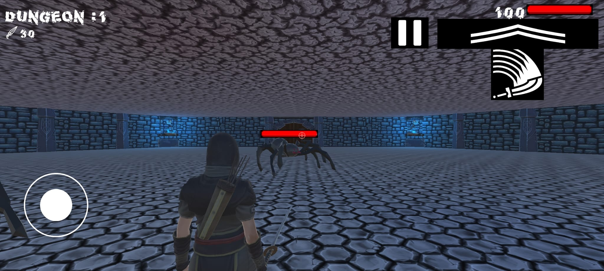
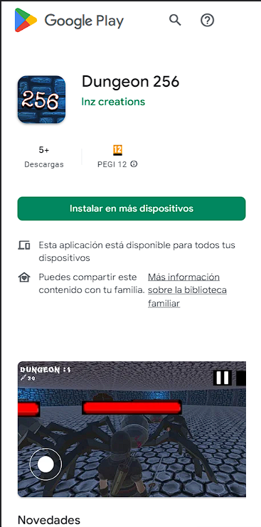

<!-- # JS-DAW-2022-practicas-Lorenzo
 Desarrollo Web en Entorno Cliente

Editado Lorenzo Navarro Jiménez -->

# Sobre mi , Lorenzo Navarro Jiménez 

*Programador y Técnico Informático*

---
Titulos

* Grado Medio Sistemas Microinformaticos y Redes
* Grado Superior Desarrollo Aplicaciones Multiplataforma
* Grado Superior Desarrollo Aplicaciones Web

Proyectos

* Videojuego Dungeon 256 en Play Store Android

<!-- {width=2cm} -->
Aptitudes

Contacto

